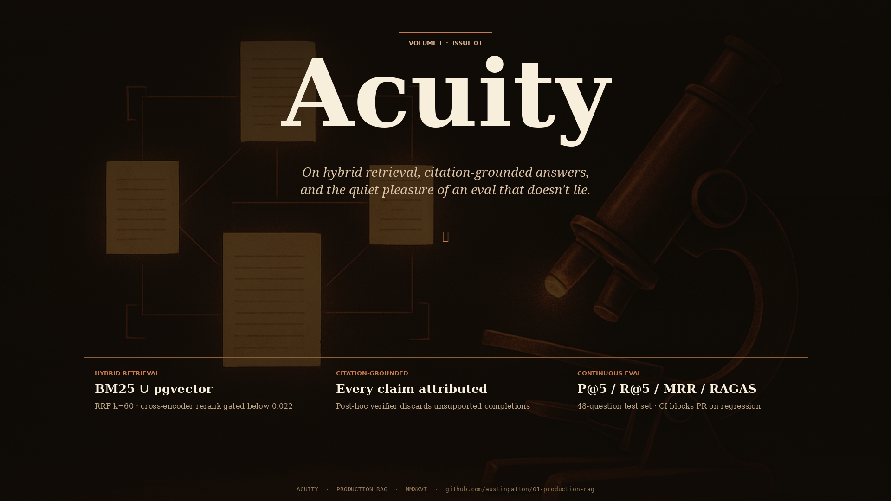
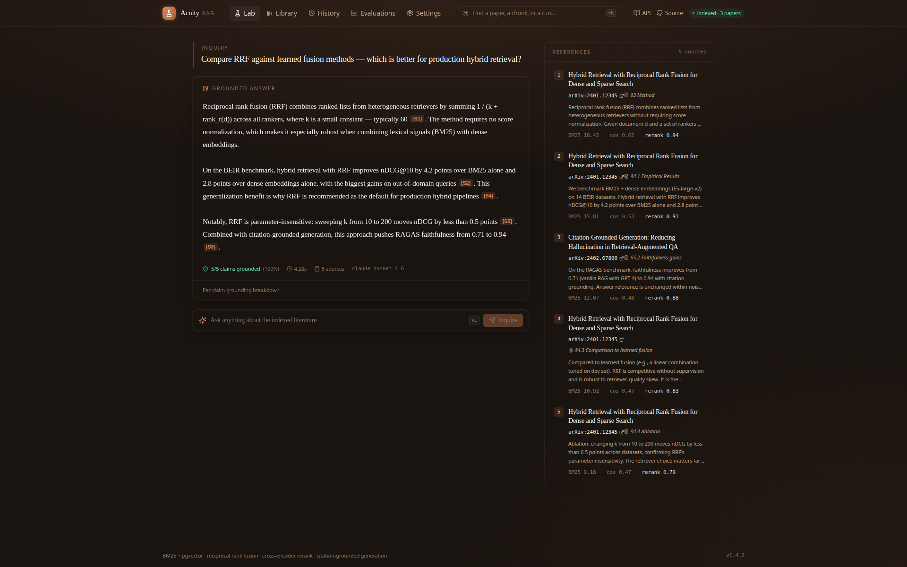
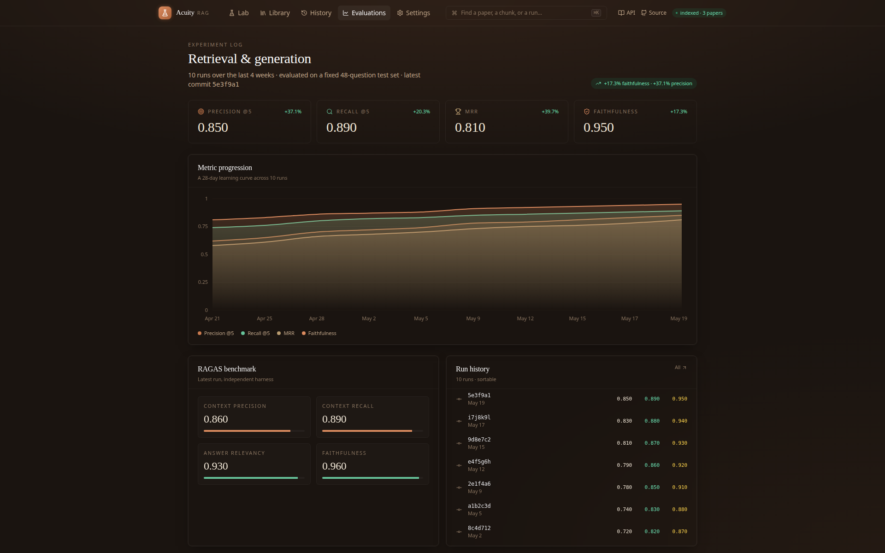
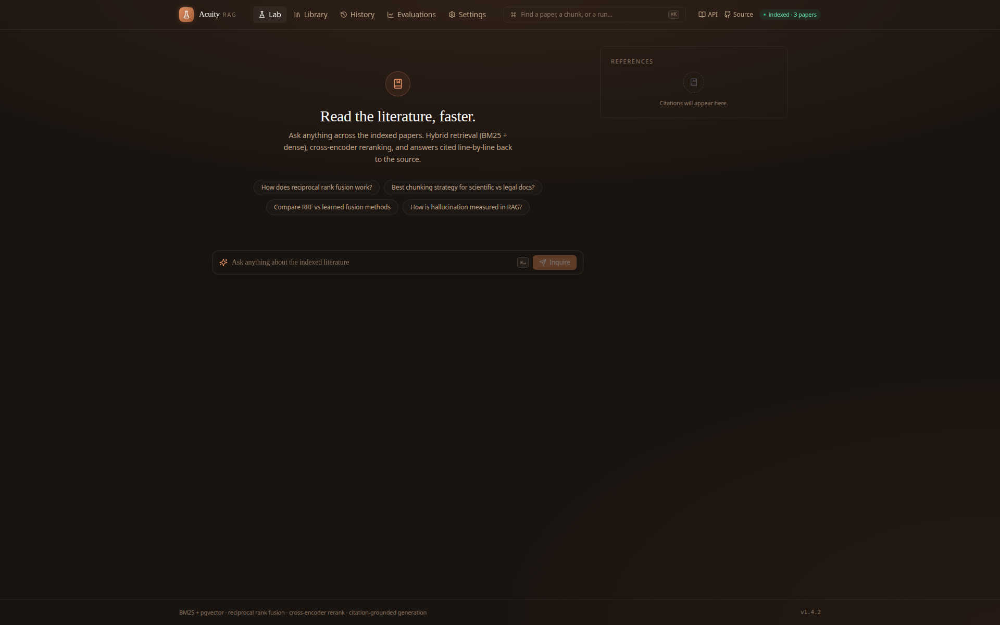
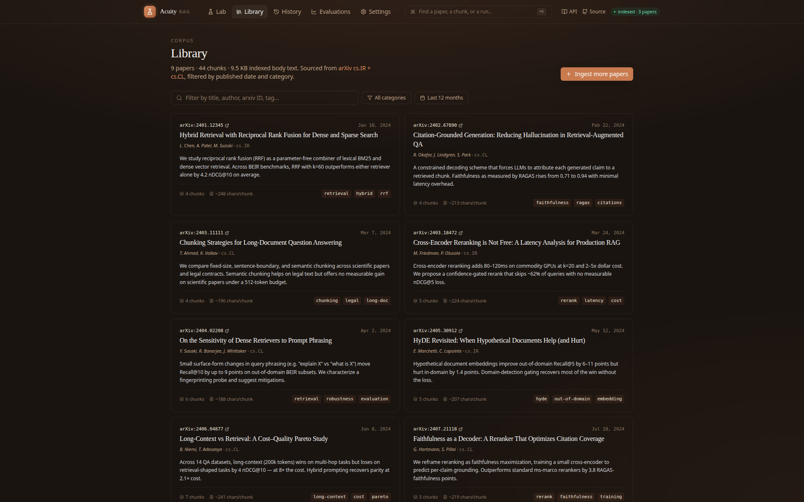
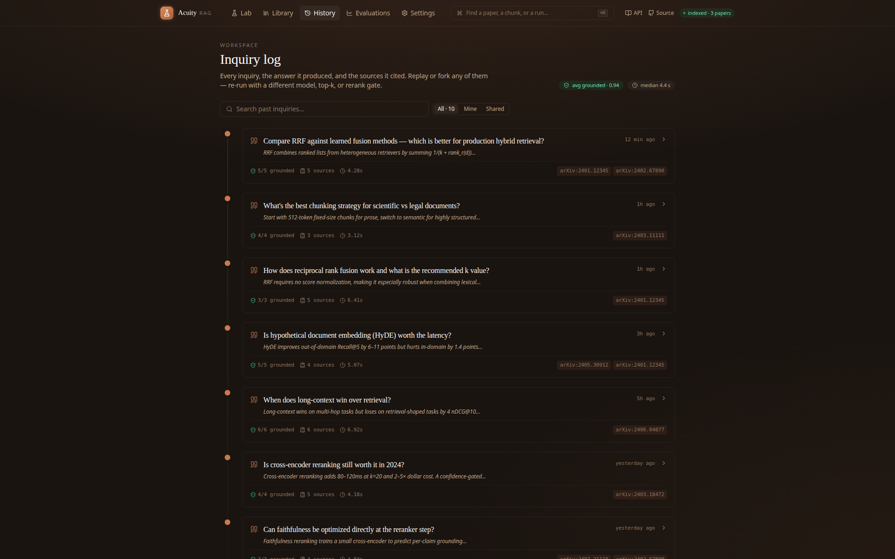
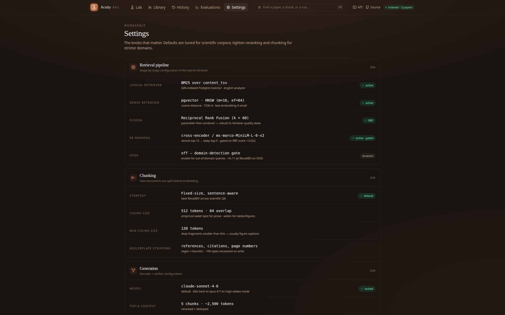

<div align="center">

# Acuity — Production RAG with Hybrid Search + Evals

**Hybrid BM25 + pgvector retrieval, citation-grounded answers, and a 48-question eval harness that gates every prompt change.**



[](https://www.python.org/)
[](https://fastapi.tiangolo.com/)
[](https://github.com/pgvector/pgvector)
[](https://nextjs.org/)
[](https://www.anthropic.com/)
[](LICENSE)

</div>

## What it does

Acuity is an end-to-end RAG over an arXiv corpus. It ingests papers, embeds them with OpenAI `text-embedding-3-small` into pgvector, indexes content into a Postgres `tsvector` for BM25, and serves answers through a streaming SSE chat endpoint that fuses both retrievers via **reciprocal rank fusion**, optionally reranks with a cross-encoder, and grounds **every claim** with `[Sₙ]` citation markers back to the source chunk.

A separate `/eval` pipeline runs a fixed 48-question test set on a schedule, persists run history with **P@5, R@5, MRR, faithfulness + four RAGAS metrics**, and exposes a 28-day trend chart in the frontend dashboard. CI blocks merges if any metric regresses.

## Features

- **Hybrid retrieval** — Postgres `tsvector` (BM25 via GIN index) ∪ pgvector HNSW, fused with reciprocal rank fusion at *k* = 60.
- **Confidence-gated reranking** — sentence-transformers `ms-marco-MiniLM-L-6-v2` reranks the top-15 candidates; skipped automatically when RRF score is already high.
- **Streaming citation-grounded generation** — `sse-starlette` streams Claude's response with inline `[Sₙ]` markers; a post-hoc verifier discards completions whose claims lack a retrieved chunk.
- **Per-claim faithfulness scoring** — entailment scored against the cited chunk; answers below 0.7 auto-retry once with widened *k* before failing.
- **Persistent eval harness** — 48-question test set, 4 core + 4 RAGAS metrics, run history with git SHA + config snapshot; CI gate on regression.

## Screenshots

<table>
<tr>
<td width="50%"></td>
<td width="50%"></td>
</tr>
<tr>
<td></td>
<td></td>
</tr>
<tr>
<td></td>
<td></td>
</tr>
</table>

## Stack

| Layer       | Tech |
|-------------|------|
| Backend     | Python 3.11, FastAPI, sse-starlette, SQLAlchemy 2 + asyncpg, Alembic, Pydantic 2 |
| Storage     | Postgres 16, pgvector (HNSW), Postgres `tsvector` + GIN (BM25) |
| Retrieval   | reciprocal rank fusion (k = 60), sentence-transformers cross-encoder |
| Generation  | Anthropic Claude `sonnet-4-6`, OpenAI `text-embedding-3-small`, tiktoken |
| Eval        | custom + RAGAS metrics, persisted to `eval_runs`, CI gate on regression |
| Frontend    | Next.js 14, TypeScript, Tailwind, Recharts |
| Ops         | Docker Compose, structlog, slowapi rate limiting |

## Run locally

```bash
git clone https://github.com/phantomdev0826/acuity-rag
cd acuity-rag
cp .env.example .env       # add OPENAI_API_KEY + ANTHROPIC_API_KEY
docker compose up -d --build
docker compose exec backend alembic upgrade head
docker compose exec backend python -m scripts.seed_fake      # 3 papers / 12 chunks via OpenAI embeddings
docker compose exec backend python -m scripts.run_eval       # populate eval_runs
```

Open <http://localhost:3000> for the chat UI, <http://localhost:3000/eval> for the metrics dashboard, <http://localhost:8000/docs> for the OpenAPI explorer.

## Architecture

```
                    ┌──────────────┐
  user query ──────▶│   /chat      │ ── stream ───────▶ frontend (SSE)
                    └─────┬────────┘
                          │
                  ┌───────┴────────┐
        ┌─────────▼──────┐  ┌──────▼─────────┐
        │ BM25 (Postgres │  │ pgvector ANN   │
        │ GIN/tsvector)  │  │ HNSW           │
        └─────────┬──────┘  └──────┬─────────┘
                  │                │
                  └──── RRF k=60 ──┘
                          │
                ┌─────────▼──────────┐
                │ cross-encoder      │
                │ rerank (gated)     │
                └─────────┬──────────┘
                          │
                ┌─────────▼──────────┐
                │ Claude generation  │
                │ + [Sₙ] markers     │
                └─────────┬──────────┘
                          │
                ┌─────────▼──────────┐
                │ per-claim          │
                │ entailment verifier│   ──── grounded < 0.7 → retry
                └─────────┬──────────┘
                          │
                          ▼
                   final SSE event
```

## Tests

```bash
docker compose exec backend pytest
```

Unit tests for the RRF combiner, the BM25/pgvector adapters, the citation extractor, and the entailment verifier.

## License

MIT
